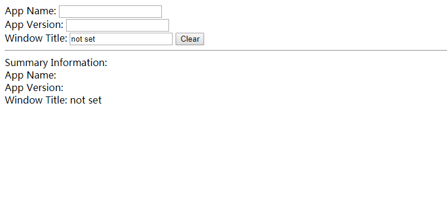
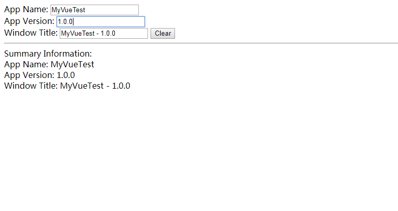
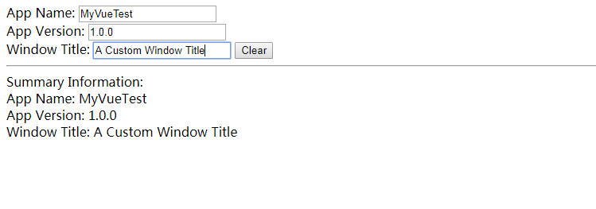
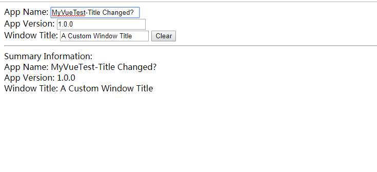
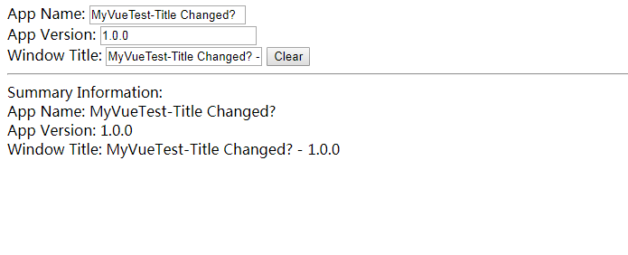

# About
Layer is good, and hard.

# Play Yourself
- Firstly, clone the repository to your local directory
```bash
git clone https://github.com/xhd2015/through-layers
```

- Secondly, change to the directory, and prepare environment
```bash
npm install
```

- Thirdly, **View What You Can See**
```bash
# compile some test modules
npm run build-test-html-cache-input
# and open them in the browser
# the HTML file is located at:  test/html-cache-input/test-template-config-html.html
npm run open-test-html-cache-input
```
If you open the html file in a browser, you will see the following page:


As you can see, `Window Title` currently shows as **"not set"**,
And if you fill the input in `App Name` and `App Version`, you can find that `Window Title` is automatically changed based on that two properties:


There is no magic up to now, all we see can be finished by a simple Vue routine.Now, let's input on the `Window Title` input box, after that, change `App Name` or `App Version`, you will find that `Window Title` is no longer affected by them.



Now, click `Clear` button, you will find `Window Title` reevaludated using `App Name` and `App Version`



**How did all these happen?**

To be simple, the configuration is as follows:
```javascript
// the config
let config = {
    _meta:{
        // the cache root is "cache"
        cacheRoot:"cache"
    },
    // the property can be a path string
    "app.name":"${cache.app.name}",
    // and can also be a plain object, note that this object will eventually becomes: "app.version"
    app:{
        version:"${cache.app.version}"
    },
    window:{
        // try in order
        title:["${cache.window.title}","${app.name} - ${app.version}","not set"]
    }
}
```
Let me explain, the `config` object represents a render model, and you can see that `window.title` has the render schema:`["${cache.window.title}","${app.name} - ${app.version}","not set"]`, that is, it will try `"${cache.window.title}"` firstly, if it is not set, then it will try `"${app.name} - ${app.version}"`, and if any of the required property is not set, it then try `"not set"`.

Full code can be found here [test/html-cache-input/test-template-config-html.js](test/html-cache-input/test-template-config-html.js).

# Explore Other Fun
- [Explore Vue.js](VUE_INTERNAL.md)

# LICENSE
Because this project has imported production or source of other projects, to avoid any future argument about this, it is LICENSED under MIT LICENSE, GPL-v2, BSD LICENSE, Apache * LICENSE, etc.
