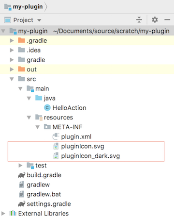

# Links
https://www.plugin-dev.com/intellij/

https://www.jetbrains.org/intellij/sdk/docs/basics/getting_started.html

# Workflow Flavor
**Gradle**(recommended) and **Plugin DevKit**(deprecated)

**Gralde** Plugin reference: https://github.com/JetBrains/gradle-intellij-plugin

# Gradle Plugin
- take cares of dependencies
- JetBrains plugins repository

Steps:

- Install `Gradle` Plugin and `Plugin DevKit`
- Choose `File`|`New...`|`Project`, Select `Gradle`-`IntelliJ Platform Plugin` as new template, remember to choose the `Use default gradle wrapper` option
- fill `groupId`, `artifactId`,and `version` 
- after the project intialized, create a Gradle Run/Debug Configuraiton:`runIdea` to run the plugin

# Plugin Project Structure
